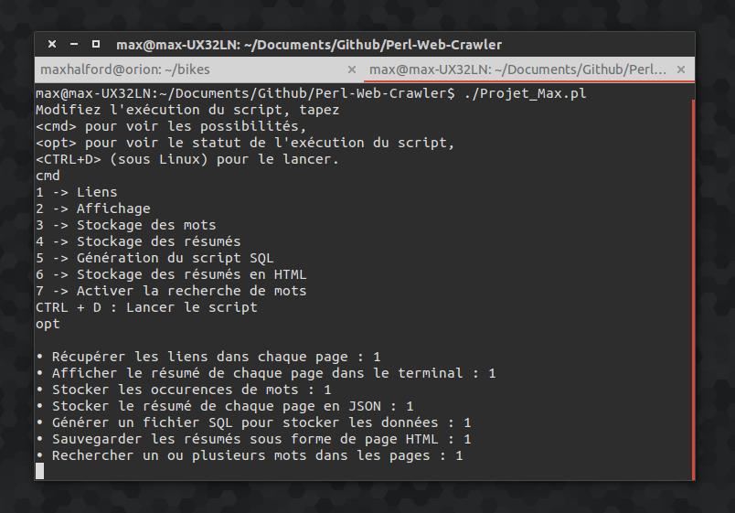
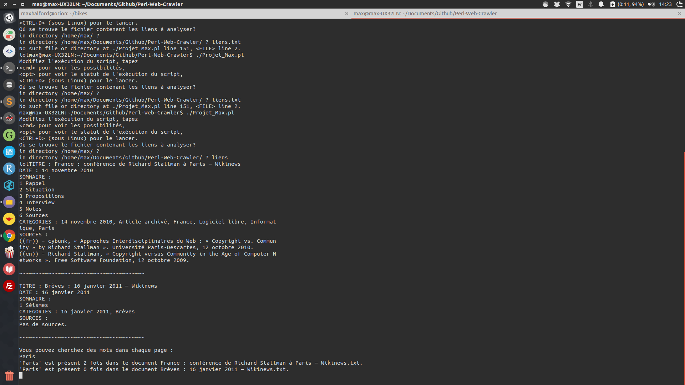

# Perl Web Crawler

This was one of my first university assignements (``tp5.pdf``) in my junior year. The idea was to crawl through a list of links and extract the relevant data in elegant format (ie. JSON, SQL and HTML). I coded a simple terminal interface so that the user could modify how the script ran (sorry but it's in French!).

If the user runs the script with ``CTRL+D`` then the sample output is the following.

A full explanation is available in the PDF file named ``Rapport.pdf``.